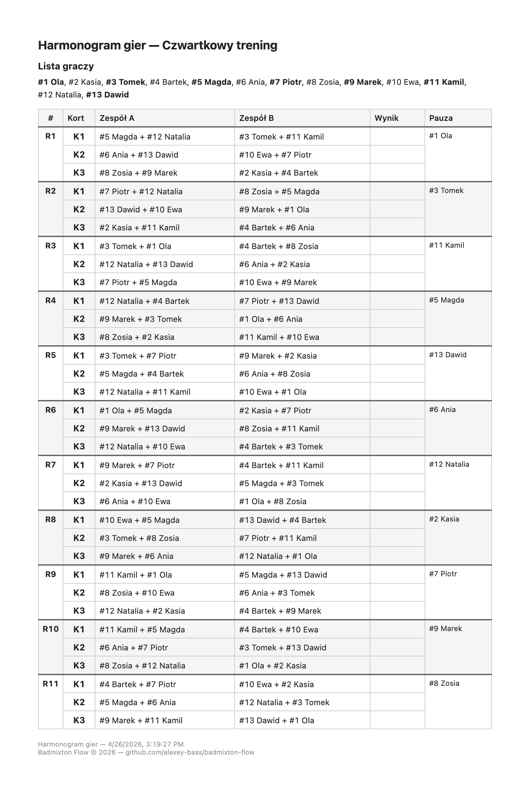

# Badmixton Flow — Badminton 2x2 Queue Manager

Web app for managing player queues and court assignments during amateur badminton doubles sessions. Designed for a coach or admin running sessions with 4–20 players on 1–5 courts.

**Primary device:** 12" tablet placed courtside. Also works on phones and desktops.

## Features

- **Player management** — add, remove, remove all, rename (with emoji support), renumber, mark present/absent, multiple partner wishes, emoji disambiguation for duplicate names
- **Two session modes** — Queue mode (classic living queue) or Shuffle mode (batch-generate games, manual game creation, editable schedule with player removal, auto-assign to courts)
- **Print schedule** — A4-friendly printout with player roster, game table grouped by rounds, bench/pause column, and empty columns for handwriting court assignments and scores; works when session is locked
- **Living queue** — automatic arrival numbering, games played counter, live wait timer, auto-requeue after each game
- **Flexible game formats** — 2v2 (default), 2v1, and 1v1 when not enough players for full doubles
- **Smart suggestions** — algorithm picks next 2–4 players based on queue position, games balance, and wishes
- **Court management** — 1–5 configurable courts, quick winner declaration or score entry on finish, cancel button for accidental starts
- **Team splitting** — minimizes pair/opponent repeats, respects wish pairings, custom swap option with bench
- **Score tracking** — declare winner with one tap or enter exact score, win/loss and points per player
- **Results leaderboard** — ranked by wins, win rate, and point differential; click any player for detailed stats; configurable visibility and limit (full/top 3/5/10)
- **Player statistics** — per-player modal with favorite partner, best pair, most common opponent, head-to-head records
- **Session highlights** — fun stats: most active, win streak, top scorer, social butterfly, rivals, most patient, avg wait time
- **Match history** — filterable by court and player, visible to all; undo admin-only
- **Drag-and-drop** — reorder queue manually (mouse + touch)
- **Two UI modes** — Board (player-facing: courts, queue, results) and Management (admin: full control)
- **Screen wake lock** — keeps the tablet display on during sessions (Screen Wake Lock API)
- **Offline-first PWA** — service worker caches the app for instant loads and offline use, installable on mobile
- **Custom session name** — optional name shown in header bar, set on create or click to edit
- **Session lock** — manual or timed lock disables all actions, optional queue clear on lock, red header indicator, synced across devices
- **Multi-device sync** — Firebase Realtime Database, shareable session links with auto-join
- **Quick help** — in-app instructions modal with app version, translated
- **i18n** — Polish (default) and English, with proper plural forms
- **JSON export/import** — backup and restore session data
- **Analytics** — Google Analytics event tracking for user flow analysis
- **Debug tools** — session inspector, localStorage viewer, clear data

## Screenshots

<p>
  <a href="screenshots/01-board.png"></a>
  <a href="screenshots/02-players.png"></a>
  <a href="screenshots/03-results.png"></a>
  <a href="screenshots/04-queue.png"></a>
  <a href="screenshots/05-courts.png"></a>
  <a href="screenshots/06-session.png"></a>
  <a href="screenshots/07-history.png"></a>
  <a href="screenshots/08-help.png"></a>
  <a href="screenshots/09-print-schedule.png"></a>
</p>

## Quick Start

Open `index.html` in a browser. No server, no build tools, no npm required.

For local development:

```bash
npm start
# or
python3 -m http.server 8080
```

Then open [http://localhost:8080](http://localhost:8080).

## Project Structure

```
index.html                      — App shell, 10 tab panels, modals
assets/css/styles.css           — All styles, CSS variables, responsive breakpoints
assets/js/app.js                — Application logic
assets/js/i18n.js               — Translations (Polish + English) and i18n engine
assets/img/favicon-*.png        — Shuttlecock favicons (16px, 96px, 192px, 512px)
manifest.json                   — PWA manifest (name, icons, theme)
service-worker.js               — Offline-first cache for app shell
hooks/pre-commit                — Auto-stamps version, cache-bust params, SW version
package.json                    — npm start script for local dev server
CLAUDE.md                       — AI assistant context (architecture, data model)
ALGO.md                         — Algorithm documentation with scoring weights, examples, quality criteria
test/                           — Node.js tests (node:test runner)
scripts/                        — Screenshots, simulation, and validation scripts
```

## How It Works

### Living Queue

Players arrive and get a sequential number (#1, #2, ...). New players who haven't played yet are promoted ahead of those who have, so latecomers get to play sooner. After a game finishes, all 4 players go to the end of the queue. Queue position is the primary factor for who plays next.

### Suggestion Algorithm

Picks the best 2–4 players (depending on queue size) by scoring each candidate:
- Queue position (highest priority)
- Games above average penalty (fairness)
- Unfulfilled wish bonus
- Diversity check (2v2 only): if 3+ of the top 4 were in the same recent match, swaps one out for a fresh player

Supports three game formats: **2v2** (4 players, 3 possible splits), **2v1** (3 players, 3 possible splits), and **1v1** (2 players, 1 split). Falls back to smaller formats when not enough players are available.

Then splits them into two teams minimizing:
- Pair repeat penalty (2-player teams only)
- Opponent repeat penalty
- While maximizing wish fulfillment

Three algorithmic split options are shown (when applicable), plus a **Custom** option where players can tap to swap teammates between teams or bring in anyone from the queue bench.

### Score Tracking

When finishing a game, a modal lets you declare the winner by tapping the winning team, declare a draw, or enter an exact score. Winner declaration tracks wins/losses without needing a score. If a score is entered (e.g. 21:15), points are also tracked per player. Results are shown on the leaderboard. A cancel button (↩) next to Finish lets you undo accidentally started games.

### Two Modes

- **Board mode** (toggle via gear icon) — clean view for players: courts with teams + timer, queue list, results leaderboard
- **Management mode** — full admin control: all tabs, player management, manual selection, settings, sync, debug

### Multi-Device Sync

1. Click **New session** — it automatically connects to Firebase (no separate step)
2. Go to the **Session** tab, copy the share link and send it to players
3. Anyone opening the link auto-joins the session and sees live updates
4. On page refresh, sync reconnects automatically

Joining via URL or the Join button requires the session to already exist — you cannot create sessions by guessing IDs.

Sync uses Firebase Realtime Database. Configuration is inlined in `index.html`.

## Tech Stack

- Pure HTML / CSS / JavaScript — no frameworks, no build tools
- PWA with service worker — offline-first, installable
- Firebase Realtime Database v10.12.0 (compat SDK, loaded via CDN)
- `localStorage` for persistence
- Google Analytics (gtag.js)
- Mobile-first responsive CSS
- Preconnect hints for faster CDN loading
- Node.js built-in test runner (`node:test`) — 430+ tests, zero dependencies
- Lighthouse CI — 100/100 across Performance, Accessibility, and SEO

## Simulation

Run a full session simulation to test the suggestion algorithm and generate an HTML report:

```bash
npm run simulation                                                    # queue mode: 4 courts, 17 players, 2 late, 10 rounds, en
npm run simulation -- --courts 2 --players 10 --late 1 --rounds 5     # custom params
npm run simulation -- --lang pl                                       # Polish report
npm run simulation:shuffle                                            # shuffle mode: 4 courts, 17 players, 2 late, 10 rounds
npm run simulation:shuffle -- --courts 4 --players 17 --rounds 10 --lang pl --output report.html
npm run simulation:validate                                           # run 10 shuffle simulations, check quality criteria
```

Queue simulation generates `simulation-report.html`, shuffle generates `simulation-shuffle-report.html`. Both support `--lang pl|en`. Open in browser and print to PDF.

`simulation:validate` runs 10 shuffle-mode simulations and checks algorithm quality criteria (see [ALGO.md](ALGO.md)): no partner pair repeats, no frequent opponents, no group regrouping, fair games distribution, late player fairness. Included in `npm run validate`.

## Tested On

- MacBook Air M3 (macOS, Chrome/Safari)
- Samsung S24 Ultra (Android, Chrome)
- Xiaomi Redmi Pad Pro 12.1" (HyperOS, Chrome)
- Magcubic L018 (Google Chrome)

## License

All rights reserved. Contact the author for permission to use this software. See [LICENSE](LICENSE) for details.
